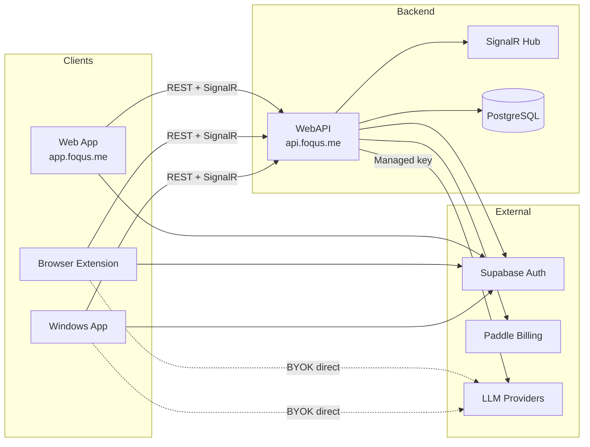

# Foqus MVP — Multi-Client Rollout

## Product Vision

Foqus is a productivity platform that keeps you aligned to a single task by classifying your focus context in real time. The MVP rollout extends the existing Windows app and browser extension into a unified cloud-backed platform with a dedicated web app, three-tier subscription model, cross-device sync, and centralized full analytics — while keeping native clients focused on capture, live alignment, and basic local analytics.

---

## Subscription Model

| Feature | Free (BYOK) | Cloud BYOK | Cloud Managed |
|---|---|---|---|
| Classification | Client → backend → provider | Client → backend → provider | Client → backend → provider |
| API key | User-provided (sent via X-Api-Key) | User-provided (sent via X-Api-Key) | Platform-managed |
| Basic analytics | Local only | Local + cloud | Local + cloud |
| Full analytics (web) | — | Yes | Yes |
| Cross-device sync | — | Yes | Yes |
| Account required | Yes | Yes | Yes |
| Price | $0 | Lower tier | Higher tier |

---

## Epic Map

| # | Epic | Description | Link |
|---|---|---|---|
| 1 | Shared Contracts & Entitlement Model | Define plans, shared terminology, schemas, API contracts, and entitlement rules before any client work begins. | [epic-1](epics/epic-1-foundation-contracts/README.md) |
| 2 | Windows App Local/Basic Mode | Extend the Windows app with plan awareness, device registration, cloud session submission, and SignalR sync. | [epic-2](epics/epic-2-windows-app/README.md) |
| 3 | Web App Platform Shell & Auth | Stand up `app.foqus.me` as a separate SPA with authentication, integrations page, and device management. | [epic-3](epics/epic-3-web-app-platform/README.md) |
| 4 | Browser Extension Local/Basic Mode | Extend the extension with plan awareness, device registration, cloud session submission, and SignalR sync. | [epic-4](epics/epic-4-browser-extension/README.md) |
| 5 | Web Full Analytics | Build the centralized analytics dashboard for paid cloud users in the web app. | [epic-5](epics/epic-5-full-analytics/README.md) |
| 6 | Cross-Device Sync | Enable reliable data sync across all clients, with conflict resolution, offline recovery, and real-time push. | [epic-6](epics/epic-6-cross-device-sync/README.md) |

---

## Recommended Implementation Order

```
Epic 1 → Epic 2 → Epic 3 → Epic 4 → Epic 5 → Epic 6
```

**Rationale:**

1. **Epic 1 (Foundation)** — All clients and the backend depend on shared contracts. Nothing ships without these.
2. **Epic 2 (Windows app)** — Primary product. First client to implement the new plan model and cloud awareness.
3. **Epic 3 (Web app platform)** — The web app must exist before full analytics can be built. Auth and integrations are prerequisites for Epics 5 and 6.
4. **Epic 4 (Browser extension)** — Extension follows once the auth/plan/integration model is stable and battle-tested from Epic 2.
5. **Epic 5 (Full analytics)** — Requires the web app (Epic 3) and at least one data-producing client (Epic 2). All data producers should ideally be live first.
6. **Epic 6 (Cross-device sync)** — Requires all producers (Epics 2, 4) and the web dashboard (Epic 5) to be functional. Most complex, highest risk.

---

## Shared Terminology

| Term | Definition |
|---|---|
| **Session** | A time-bounded focus period. Starts when a user defines a task, ends explicitly or by timeout. Contains aligned/distracted time, focus score, and metadata. |
| **Classification** | A single evaluation of whether the current context (window title, URL, page title) aligns with the active task. Returns `Aligned`, `NotAligned`, or `Unclear`. |
| **Aligned / Not Aligned** | Classification outcomes. "Aligned" means the current context matches the task. "Not Aligned" means it does not. |
| **Basic analytics** | Local-only analytics available to all users: session list, session duration, aligned vs distracted time, simple counts, last 7 days summary. |
| **Full analytics** | Cloud analytics for paid users only: trends over time, multi-device view, deeper charts, filters, comparisons, cloud history. Lives exclusively in the web app. |
| **Device / Integration** | A registered client installation: a Windows app install or a browser extension install. Identified by type, fingerprint, name, version. |
| **Heartbeat** | A periodic signal from a device to the backend indicating it is online. Used for presence tracking on the integrations page. |
| **Focus Score** | A time-weighted alignment percentage (0–100) computed over a session. |

---

## High-Level Architecture



---

## Non-Goals for Initial Rollout

Do **not** implement in the first pass:

- Full analytics UI duplicated in the Windows app or browser extension
- Local full-analytics engine
- Enterprise policy / admin features
- Team or shared dashboards
- Complex offline-first merge logic beyond a simple retry queue
- Provider abstraction beyond current supported models (OpenAI, Anthropic, Google)
- Mobile clients

---

## Success Criteria

### Windows App
- User can use BYOK locally without an account
- User can sign in and choose a plan
- User can see basic analytics locally
- User can open full analytics in the web app
- Managed plan routes classification through backend
- Signed-in app appears in integrations list with live status

### Browser Extension
- User can use BYOK locally without an account
- User can sign in and choose a plan
- User can see basic analytics locally
- User gets live browser alignment status (popup + overlay)
- User can open full analytics in the web app
- Signed-in extension appears in integrations list with live status

### Web App
- User can sign in and register at `app.foqus.me`
- User can see all connected integrations and their status
- Paid users can access full analytics dashboard
- Cloud users get unified cross-device analytics

---

## Read Next

- [Epic 1 — Shared Contracts & Entitlement Model](epics/epic-1-foundation-contracts/README.md)
- [Epic 2 — Windows App Local/Basic Mode](epics/epic-2-windows-app/README.md)
- [Epic 3 — Web App Platform Shell & Auth](epics/epic-3-web-app-platform/README.md)
- [Epic 4 — Browser Extension Local/Basic Mode](epics/epic-4-browser-extension/README.md)
- [Epic 5 — Web Full Analytics](epics/epic-5-full-analytics/README.md)
- [Epic 6 — Cross-Device Sync](epics/epic-6-cross-device-sync/README.md)
