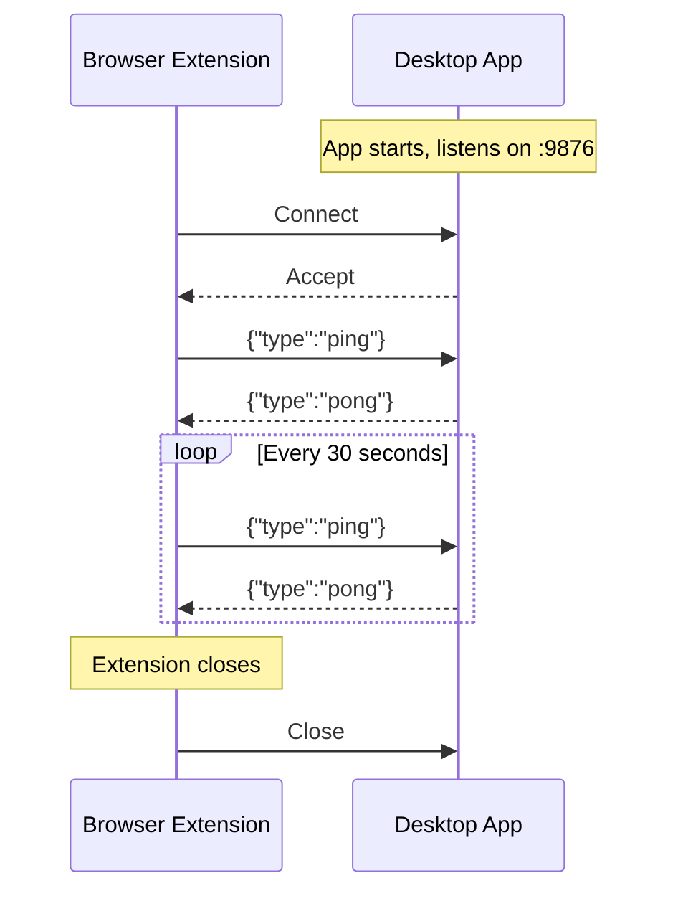

# Extension Presence Protocol

Local WebSocket protocol for presence signaling between the desktop app and browser extension running on the same machine.

---

## Purpose

When both the desktop app and browser extension are running, they can both classify browser windows. To avoid duplicate `POST /classify` API calls:

1. Desktop app runs a WebSocket server
2. Browser extension connects and sends periodic pings
3. Desktop app skips classifying Chromium browser windows when extension is online

The extension has richer context (actual URL, page title from DOM) compared to the desktop's window title, so it takes priority for browser classification.

---

## Protocol

### Connection

| Property | Value |
|----------|-------|
| Transport | WebSocket |
| Primary URL | `ws://localhost:9876/foqus-presence` |
| Backup URL | `ws://localhost:9877/foqus-presence` |
| Authentication | None (localhost only) |

### Message Format

JSON objects with a `type` field:

```json
{ "type": "ping" }
{ "type": "pong" }
```

### Message Flow



---

## Timing Constants

| Constant | Value | Owner |
|----------|-------|-------|
| Ping interval | 30 seconds | Extension sends |
| Presence timeout | 60 seconds | Desktop considers extension offline |
| Reconnect interval | 5 seconds | Extension retry on disconnect |

---

## Desktop Behavior

### Port Selection

1. Try binding to port 9876
2. If port 9876 is in use, try port 9877
3. If both fail, log warning and continue without presence server

### Connection Handling

- Accept multiple connections (different browser profiles)
- Track `LastPingUtc` timestamp
- Update `IsExtensionOnline` on each ping
- Fire `ExtensionConnected` event on first ping after offline
- Fire `ExtensionDisconnected` event on timeout

### Classification Decision

| Foreground App | Extension Online | Action |
|----------------|------------------|--------|
| Chrome/Edge/Brave | Yes | Skip classification |
| Chrome/Edge/Brave | No | Classify via window title |
| Firefox/Opera | Any | Always classify |
| Non-browser | Any | Always classify |

---

## Extension Behavior

### Startup

1. Start connecting immediately when extension loads
2. Try primary port (9876), then backup port (9877)
3. Send initial ping on connection open

### Reconnection

1. On disconnect or error, schedule reconnect in 5 seconds
2. Alternate between primary and backup ports on retry
3. Continue indefinitely (desktop may start later)

### Code Location

- Extension client: `browser-extension/src/shared/extensionPresence.ts`
- Desktop server: `FocusBot.Infrastructure/Services/ExtensionPresenceService.cs`
- Interface: `FocusBot.Core/Interfaces/IExtensionPresenceService.cs`

---

## Failure Modes

| Scenario | Behavior |
|----------|----------|
| Desktop not running | Extension connects fail silently, retries every 5s |
| Extension not installed | Desktop server runs with no connections, `IsExtensionOnline = false` |
| Connection drops | Extension reconnects, desktop times out after 60s |
| Both classify briefly | Server-side classification coalescing (1s window) deduplicates |
| Port conflict | Desktop falls back to backup port, extension tries both |

---

## Security Considerations

- Localhost-only binding prevents remote connections
- No authentication required (same-machine trust)
- No sensitive data exchanged (ping/pong only)
- Port numbers are well-known but arbitrary
