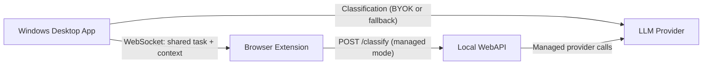

<!--
Purpose: Entry-point documentation for the Foqus platform.
This file intentionally summarizes and links to the deeper, single-purpose docs to reduce drift.
-->
# Foqus Platform Overview

Foqus is a productivity platform that helps you stay aligned to a single task by classifying your current focus context and tracking alignment over time.

It consists of three main parts:

1. A Windows desktop app (foreground window monitoring + focus scoring + local analytics)
2. A browser extension (page/tab monitoring + per-page focus classification + in-browser overlays)
3. A local WebAPI (auth + classification orchestration + session/history endpoints)

The desktop app and the browser extension can operate independently, but they integrate to share one active task and keep the focus status in sync.

---

## Table of Contents

1. [Platform Purpose](#platform-purpose)
2. [Major Components](#major-components)
3. [Windows Desktop App](#windows-desktop-app)
4. [Browser Extension](#browser-extension)
5. [Local WebAPI](#local-webapi)
6. [App Extension Integration](#app-extension-integration)
7. [Auth & Classification Modes](#auth--classification-modes)
8. [Data & Privacy Boundaries](#data--privacy-boundaries)
9. [How to Use the Platform](#how-to-use-the-platform)
10. [Read Next](#read-next)

---

## Platform Purpose

Foqus focuses on an alignment model:

- You define a task (and optional hints).
- Foqus classifies whether the currently active window or browser page matches that task.
- It tracks alignment over time as a focus score, plus distraction events and daily analytics.

The result is real-time feedback (Focused / Unclear / Distracted) and retrospective insights (history + analytics).

---

## Major Components

### Desktop App (summary)

- Monitors the foreground window on Windows (Win32 polling).
- Runs focus classification and computes a time-weighted focus score.
- Stores task/session history locally.

Details: [`docs/app-documentation.md`](./app-documentation.md)

### Browser Extension (summary)

- Tracks the active browser tab URL/title.
- Classifies pages against your active task.
- Shows an in-browser distraction overlay when relevant.

Details: [`browser-extension/EXTENSION.md`](../browser-extension/EXTENSION.md)

### WebAPI (summary)

- Runs on `http://localhost:5251` (dev default).
- Provides authenticated endpoints for classification orchestration, session/history, and subscription status.

Feature slices:

- [`src/FocusBot.WebAPI/Features/Auth/SLICE.md`](../src/FocusBot.WebAPI/Features/Auth/SLICE.md)
- [`src/FocusBot.WebAPI/Features/Classification/SLICE.md`](../src/FocusBot.WebAPI/Features/Classification/SLICE.md)
- [`src/FocusBot.WebAPI/Features/Sessions/SLICE.md`](../src/FocusBot.WebAPI/Features/Sessions/SLICE.md)
- [`src/FocusBot.WebAPI/Features/Subscriptions/SLICE.md`](../src/FocusBot.WebAPI/Features/Subscriptions/SLICE.md)

---

## Windows Desktop App

The Windows app provides the “single task” workflow and real-time feedback across desktop apps.

Key capabilities (high level):

- Single-task flow: start a task, receive live status as you switch windows, end the task to save a session summary.
- Real-time status: a focus status bar shows the current app/window and classification output.
- Focus Score: a time-weighted alignment percentage (0–100) updated continuously and finalized with the session.
- Focus page (active session): shows focused time, **total** elapsed time (center), distracted time, distraction count, and (when signed in) a green/red focus score bar with labels below the bar.
- Caching: classification results are cached per window context to reduce repeated model calls.
- Idle detection: pauses tracking when the user is idle to avoid counting “off-task” time during inactivity.
- Daily analytics: distraction events are aggregated into daily summaries.

Details (including UI behavior, stack, and technical architecture):

- [`docs/app-documentation.md`](./app-documentation.md)

---

## Browser Extension

The extension enables the same alignment idea inside the browser:

- A session is created in the extension with a task title (and optional hints).
- Each page navigation triggers classification when the session is active.
- If a page is distracting, a distraction alert overlay is presented inside the tab.

Key concepts:

- Runtime state is stored in `chrome.storage.local`.
- The background service worker orchestrates classification, caching, session lifecycle, and analytics aggregation.
- The extension supports pausing/resuming based on both user action and system idle state.
- Excluded domains can be treated as aligned without classifier calls.

Details:

- [`browser-extension/EXTENSION.md`](../browser-extension/EXTENSION.md)

---

## Local WebAPI

The local WebAPI is used primarily for:

- Authenticated identity checks for the “Foqus account” mode
- Classification when operating with managed keys (instead of BYOK)
- Session and history data operations
- Subscription/trial gating for managed classification

### API Endpoints (from feature slices)

#### Authentication

- `GET /auth/me` (required auth): returns current user profile and subscription status.
  - Source: [`src/FocusBot.WebAPI/Features/Auth/SLICE.md`](../src/FocusBot.WebAPI/Features/Auth/SLICE.md)

#### Classification

- `POST /classify` (required auth): classifies whether the current window/tab context aligns with the active task.
  - BYOK vs managed mode:
    - BYOK: optionally uses an `X-Api-Key` header to call the selected LLM provider directly.
    - Managed: uses a configured managed key when `X-Api-Key` is not provided.
  - Source: [`src/FocusBot.WebAPI/Features/Classification/SLICE.md`](../src/FocusBot.WebAPI/Features/Classification/SLICE.md)

#### Sessions

- `POST /sessions` (required auth): start a new focus session
- `POST /sessions/{id}/end` (required auth): end a session and record focus metrics
- `GET /sessions/active` (required auth): get the active session (if any)
- `GET /sessions` (required auth): paginated completed session history
- `GET /sessions/{id}` (required auth): get a single session by id
  - Source: [`src/FocusBot.WebAPI/Features/Sessions/SLICE.md`](../src/FocusBot.WebAPI/Features/Sessions/SLICE.md)

#### Subscriptions

- `GET /subscriptions/status` (required auth): current subscription status
- `POST /subscriptions/trial` (required auth): activate a 24-hour trial
- `POST /subscriptions/paddle-webhook` (anonymous): webhook receiver (Paddle events)
  - Source: [`src/FocusBot.WebAPI/Features/Subscriptions/SLICE.md`](../src/FocusBot.WebAPI/Features/Subscriptions/SLICE.md)

---

## App Extension Integration

When both the Windows app and the extension are running, Foqus keeps a single shared task in sync via a local WebSocket connection.

### WebSocket Details

- Desktop app WebSocket server:
  - `http://localhost:9876/focusbot/`
  - Implemented by the desktop app integration service
- Extension WebSocket client:
  - `ws://localhost:9876/focusbot`
  - Reconnects on a fixed interval when disconnected

Source: [`docs/app-extension-integration.md`](./app-extension-integration.md)

### Shared-task Behavior

The platform guarantees one active task across both components:

- Either side can start the task.
- Conflicts on simultaneous starts are prevented; on reconnect, one side takes precedence (the app wins).
- The status bar focus classification is driven by the current “effective” context and classification source.

### Message Types (envelope-based JSON)

Both sides exchange a typed JSON envelope:

`{ "type": "<MESSAGE_TYPE>", "payload": { ... } }`

Important message types include:

- `HANDSHAKE` (session sync on connect)
- `TASK_STARTED` and `TASK_ENDED` (shared task lifecycle)
- `FOCUS_STATUS` (classification output for the shared task)
- `DESKTOP_FOREGROUND` (app -> extension context)
- `BROWSER_CONTEXT` (extension -> app context)

Source: [`docs/app-extension-integration.md`](./app-extension-integration.md)

---

## Auth & Classification Modes

Foqus supports two broad classification modes:

### BYOK (Bring Your Own Key)

- The desktop app calls the configured LLM provider directly using a user-provided API key.
- The browser extension calls the classifier directly from the browser using the user-provided key.

### Foqus account (Managed / Subscription-gated)

- Users sign in using a Supabase magic link flow.
- The browser extension stores the Supabase access token locally and uses it to call the local WebAPI for classification.
- The WebAPI uses a managed provider key for `/classify`, and subscription status can gate access (including trial handling in the subscription feature slice).

Key integration points:

- Extension authentication flow and `/auth/me` usage:
  - [`browser-extension/EXTENSION.md`](../browser-extension/EXTENSION.md)
  - [`src/FocusBot.WebAPI/Features/Auth/SLICE.md`](../src/FocusBot.WebAPI/Features/Auth/SLICE.md)
- Classification orchestration via `POST /classify`:
  - [`docs/app-extension-integration.md`](./app-extension-integration.md)
  - [`src/FocusBot.WebAPI/Features/Classification/SLICE.md`](../src/FocusBot.WebAPI/Features/Classification/SLICE.md)
- Subscription gating/trial:
  - [`src/FocusBot.WebAPI/Features/Subscriptions/SLICE.md`](../src/FocusBot.WebAPI/Features/Subscriptions/SLICE.md)

---

## Data & Privacy Boundaries

High-level data boundaries:

- Desktop app session/task history is stored locally (SQLite).
- Extension sessions, settings, and cached classification results are stored in browser local storage (chrome extension storage / IndexedDB as described in the extension doc).
- Classification requests include your task and current context (window title / browser URL+title).

For deeper privacy wording and UI messaging, see:

- [`docs/app-documentation.md`](./app-documentation.md)
- [`browser-extension/EXTENSION.md`](../browser-extension/EXTENSION.md)

---

## How to Use the Platform

### Windows App Only

- Start a task in the desktop app.
- Monitor the live status bar as you switch windows.
- End the task to save session history and analytics.

### Extension Only

- Install and open the extension UI.
- Start a session and browse with the overlay/classification updates.
- End the task from the extension UI to compute session metrics.

### Full Platform (App + Extension together)

1. Start the Windows app (so the WebSocket server is available).
2. Open the extension UI; it will connect to the desktop app and sync any active task.
3. As you switch both desktop apps and browser pages, the shared task classification and status remain consistent.

Source for connection/session sync:

- [`docs/app-extension-integration.md`](./app-extension-integration.md)

---

## Read Next

- Windows app deep dive: [`docs/app-documentation.md`](./app-documentation.md)
- Extension deep dive: [`browser-extension/EXTENSION.md`](../browser-extension/EXTENSION.md)
- Shared-task integration: [`docs/app-extension-integration.md`](./app-extension-integration.md)
- WebAPI feature slices:
  - [`src/FocusBot.WebAPI/Features/Auth/SLICE.md`](../src/FocusBot.WebAPI/Features/Auth/SLICE.md)
  - [`src/FocusBot.WebAPI/Features/Classification/SLICE.md`](../src/FocusBot.WebAPI/Features/Classification/SLICE.md)
  - [`src/FocusBot.WebAPI/Features/Sessions/SLICE.md`](../src/FocusBot.WebAPI/Features/Sessions/SLICE.md)
  - [`src/FocusBot.WebAPI/Features/Subscriptions/SLICE.md`](../src/FocusBot.WebAPI/Features/Subscriptions/SLICE.md)

---

## Appendix: Component Interaction (High-Level)

