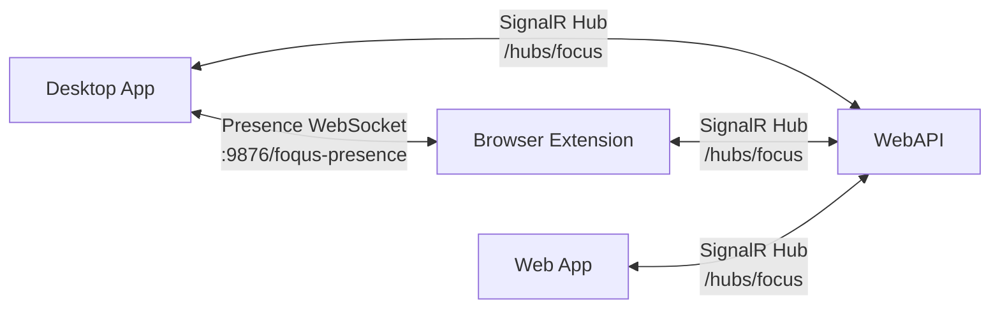
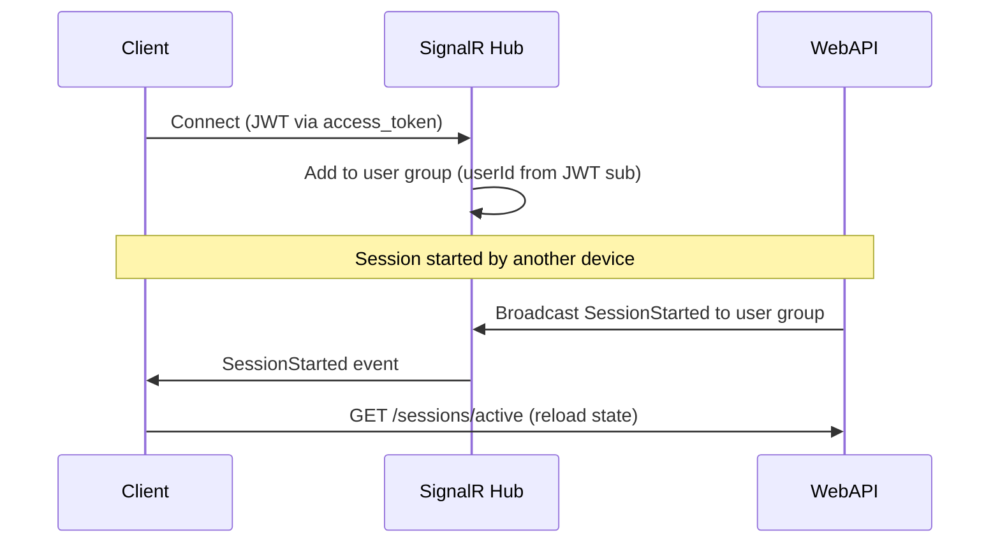
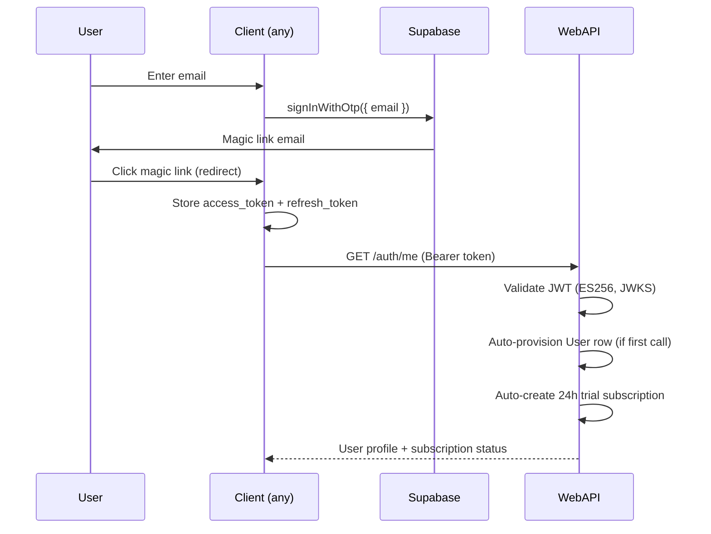
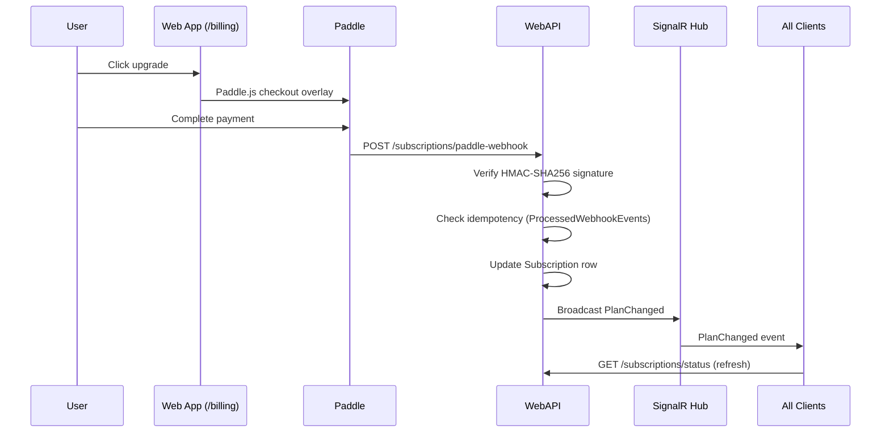

# Foqus Integration Guide

This document describes how the Foqus platform components communicate with each other. For individual component details, see the per-project documentation linked from [platform-overview.md](platform-overview.md).

---

## Integration Channels



| Channel | Transport | Port/Path | Purpose |
|---|---|---|---|
| Extension Presence | Raw WebSocket | `ws://localhost:9876/foqus-presence` | Dedup browser classification |
| SignalR Hub | WebSocket (SignalR) | `{apiBaseUrl}/hubs/focus` | Cross-device real-time events |

---

## 1. Local WebSocket — Extension Presence Only

**Server**: Desktop app (`ExtensionPresenceService` in Infrastructure)
**Client**: Browser extension (`shared/extensionPresence.ts`)

Currently, the only active local WebSocket channel is the **presence protocol** at `/foqus-presence`. Task-sync message types (`HANDSHAKE`, `TASK_STARTED`, `TASK_ENDED`, `FOCUS_STATUS`, `DESKTOP_FOREGROUND`, `BROWSER_CONTEXT`) are defined in `shared/integrationTypes.ts` but **not yet consumed** — no WebSocket client connects to `/focusbot`. Cross-device task sync is handled entirely by the SignalR hub (Section 3).

### Code Locations

| Component | File |
|---|---|
| WebSocket server | `FocusBot.Infrastructure/Services/ExtensionPresenceService.cs` (serves `/foqus-presence` only) |
| Extension client | `browser-extension/src/shared/extensionPresence.ts` (connects to `/foqus-presence` only) |
| Unused message types | `browser-extension/src/shared/integrationTypes.ts` (defined, not wired) |

---

## 2. Extension Presence Protocol (Classification Dedup)

**Server**: Desktop app (`ExtensionPresenceService`)
**Client**: Browser extension (`shared/extensionPresence.ts`)

Separate from the task-sync WebSocket, this presence channel tells the desktop app whether the browser extension is online. When the extension is online, the desktop app **skips classifying browser windows** to avoid duplicate `POST /classify` calls.

### Protocol

| Message | Direction | Purpose |
|---|---|---|
| `PING` | Extension → Desktop | Extension sends periodic ping (30s interval) |
| `PONG` | Desktop → Extension | Desktop acknowledges |

### Desktop Behavior

| Extension State | Desktop Action on Browser Window |
|---|---|
| Online (recent PING) | Skip classification — extension handles browser tabs |
| Offline (no PING > 60s) | Classify browser windows normally |

### Failure Modes

- Desktop not running: Extension classifies independently — no conflict.
- WebSocket drops: Desktop falls back to classifying browser windows after timeout.
- Both classify briefly during transition: Server-side classification coalescing (1s window) deduplicates.

See [extension-presence-protocol.md](extension-presence-protocol.md) for the full protocol spec.

---

## 3. SignalR Hub (Cross-Device Real-Time Sync)

**Hub**: WebAPI `FocusHub` at `/hubs/focus`
**Clients**: Desktop app (`FocusHubClientService`), browser extension (`shared/signalr.ts`), web app (`api/signalr.ts`)

The SignalR hub enables real-time cross-device synchronization. All clients for the same user receive the same events via per-user groups.

### Authentication

All SignalR connections require a valid Supabase JWT. The token is passed via `access_token` query parameter (required for WebSocket/SSE transports):

```
/hubs/focus?access_token={jwt}
```

### Hub Events

The hub uses a typed client interface (`IFocusHubClient`). All events are server-to-client broadcasts:

| Event | Record | Fields | Trigger |
|---|---|---|---|
| `SessionStarted` | `SessionStartedEvent` | `SessionId`, `SessionTitle`, `SessionContext?`, `StartedAtUtc`, `Source` | `POST /sessions` |
| `SessionEnded` | `SessionEndedEvent` | `SessionId`, `EndedAtUtc`, `Source` | `POST /sessions/{id}/end` |
| `SessionPaused` | `SessionPausedEvent` | `SessionId`, `PausedAtUtc`, `Source` | `POST /sessions/{id}/pause` |
| `SessionResumed` | `SessionResumedEvent` | `SessionId`, `Source` | `POST /sessions/{id}/resume` |
| `PlanChanged` | `PlanChangedEvent` | *(empty)* | Paddle webhook processing |
| `ClassificationChanged` | `ClassificationChangedEvent` | `Score`, `Reason`, `Source`, `ActivityName`, `ClassifiedAtUtc`, `Cached` | `POST /classify` |

### Per-Client Connection Patterns

**Desktop App** (`FocusHubClientService`):
- Connects after `FocusPageViewModel` is created (ensuring event handlers are subscribed first)
- On `SessionStarted`/`SessionEnded`: reloads active session from API
- On `SessionPaused`/`SessionResumed`: mirrors if matching current session
- On `PlanChanged`: refreshes `IPlanService` cache
- Disconnects on sign-out or `ReAuthRequired`
- Automatic reconnection with exponential backoff

**Browser Extension** (`shared/signalr.ts`):
- Connects after Foqus account sign-in
- On session events: reconciles local state with API
- On `ClassificationChanged`: updates current visit if from another device
- On `PlanChanged`: refreshes subscription status
- Disconnects on sign-out

**Web App** (`api/signalr.ts`):
- Connects after `AuthProvider` session is established
- On session events: refreshes dashboard state
- On `PlanChanged`: refreshes `SubscriptionContext`
- Automatic reconnection

### Connection Lifecycle



### Reconnection Strategy

All clients implement automatic reconnection:
- Exponential backoff: 0s, 2s, 10s, 30s delays
- On reconnect: reload active session from API to ensure consistency
- Hub re-adds connection to user group on `OnConnectedAsync`

See [signalr-implementation.md](signalr-implementation.md) for the full hub architecture and implementation guide.

---

## 4. Shared Auth Flow

All clients authenticate through the same Supabase project:



### Token Management

| Client | Storage | Refresh |
|---|---|---|
| Desktop | In-memory (SupabaseAuthService) | Supabase SDK auto-refresh |
| Extension | `chrome.storage.local` | Manual REST call to `/auth/v1/token` |
| Web app | Supabase JS client (localStorage) | Supabase SDK auto-refresh |

### JWKS Refresh

The WebAPI runs `JwksRefreshService` as a background hosted service, refreshing Supabase JWKS every 5 minutes to handle key rotation.

---

## 5. Paddle Subscription Lifecycle

Paid subscriptions flow through Paddle Billing and notify all connected clients:



### Webhook Events Handled

| Paddle Event | Action |
|---|---|
| `subscription.created` | Create/update Subscription row |
| `subscription.updated` | Update plan type, status, dates |
| `subscription.canceled` | Set status to Canceled |
| `transaction.completed` | Update payment details |

### Webhook Security

- **HMAC-SHA256 signature verification** via `PaddleWebhookVerifier`
- **Idempotency**: All events deduplicated by `event_id` via `ProcessedWebhookEvents` table
- **No dev bypass**: Webhook verification rejects all requests when `Paddle:WebhookSecret` is not configured

### Post-Checkout Client Behavior

| Plan | Client Action |
|---|---|
| Cloud Managed | Immediate — managed classification available |
| Cloud BYOK | Desktop: `BYOKKeyPromptDialog` prompts for API key. Extension: BYOK info banner in popup. Web app: `BYOKSetupModal` with setup steps |

---

## 6. One Active Session Per User

The platform enforces **one active session per user** across all devices:

- **Server-side**: Unique filtered index on `Sessions(UserId)` where `EndedAtUtc IS NULL`
- **Local WebSocket**: Desktop ↔ extension share the active session on the same machine
- **SignalR**: Cross-device clients receive `SessionStarted`/`SessionEnded` and reload from API
- **Conflict**: If a second device tries `POST /sessions` while one is active, the API returns 409

### Multi-Device Session Flow

1. User starts session on desktop → API creates session → SignalR `SessionStarted`
2. Extension receives event → adopts session locally → shows session card
3. Web app receives event → shows active session on dashboard
4. User ends session from web app → API ends session → SignalR `SessionEnded`
5. Desktop + extension receive event → clear local session state
