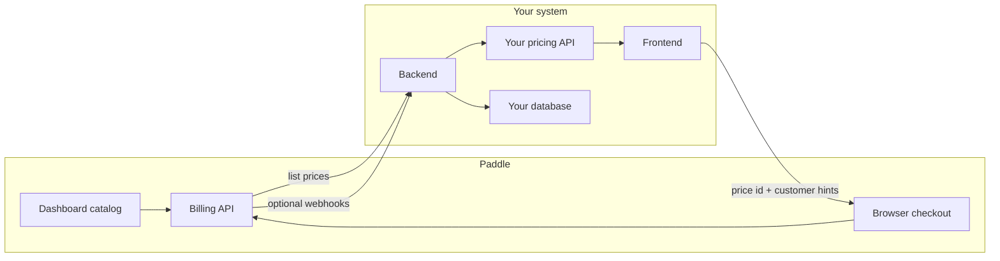

# Paddle Billing integration guide

**For Foqus-specific implementation details**, see the [**Foqus (this repository)**](#foqus-this-repository) section below. The rest of this document provides generic reference material for **.NET backend** + **browser UI** using **Paddle Billing (v2)**.

Examples use placeholders: configuration comes from environment or secrets, not hard-coded strings for hosts or tokens.

---

## Foqus (this repository)

These endpoints and shapes are implemented in **FocusBot.WebAPI** and consumed by **foqus-web-app** (Paddle.js overlay), the **browser extension**, and the **desktop app** (billing opens the web app).

### API surface

| Method | Path | Auth | Purpose |
|--------|------|------|---------|
| GET | `/pricing` | None | Proxies **active** Paddle prices for **`Paddle:CatalogProductId`** only (`pro_...`); returns `plans`, `clientToken`, `isSandbox` (10-minute server cache). |
| GET | `/subscriptions/status` | Bearer | Current plan and billing dates for the signed-in user. |
| POST | `/subscriptions/trial` | Bearer | Starts the app’s 24h trial (Paddle-independent). |
| POST | `/subscriptions/portal` | Bearer | Creates a Paddle customer portal session; response includes URL to open in browser. |
| POST | `/subscriptions/paddle-webhook` | Paddle signature | Webhook receiver; verifies `Paddle-Signature` (HMAC-SHA256 over `{ts}:{raw_body}`). |

### Checkout `custom_data`

Pass from **Paddle.js** when opening checkout so webhooks can correlate the subscription to your user:

- `user_id` — Supabase / app user id (string or guid as sent by the client).
- `plan_type` — Read from **price** `custom_data` in the dashboard: `"cloud-byok"` → `PlanType.CloudBYOK`, `"cloud-managed"` → `PlanType.CloudManaged`. For `/pricing` display only, **`license`** on the price is also accepted: `"byok"` → `cloud-byok`, `"premium"` → `cloud-managed` (prefer `plan_type` for checkout/webhook consistency).

### Webhook events handled

`SubscriptionService` uses **strongly-typed C# models** (`PaddleWebhookModels.cs`) to deserialize webhook payloads. Event types handled (Paddle Billing v2):

- `subscription.created` — Creates/updates subscription; maps status (`"trialing"` → `"trial"`, `"active"` → `"active"`)
- `subscription.updated` — Updates plan type, status, billing dates
- `subscription.canceled` — Sets status to `"canceled"`, records `CancelledAtUtc`
- `transaction.completed` — Records transaction id, billing period, payment method (card type + last 4)

**Status mapping** (`MapSubscriptionStatus`):
- `"trialing"` → `"trial"` (app convention for trial period)
- `"active"` → `"active"`
- `"past_due"` → `"active"` (treat as active with payment issue)
- `"paused"` → `"expired"`
- `"canceled"` → `"canceled"`

**Plan type resolution** (`MapPlanType`): Reads `custom_data.plan_type` from subscription or price level; fallback reads `custom_data.license` (`"byok"` → `CloudBYOK`, `"premium"` → `CloudManaged`).

**Payment details**: Extracts from nested `method_details.card.last4` (not top-level `method_details.last4`).

After DB updates, the service emits **`PlanChanged`** via SignalR (`/hubs/focus`) so desktop and web clients refresh immediately without waiting for poll intervals.

### `Subscriptions` table (troubleshooting fields)

Beyond `PaddleSubscriptionId` / `PaddleCustomerId` / `Status` / `PlanType`, rows include:

- **Billing**: `PaddlePriceId`, `PaddleProductId`, `PaddleTransactionId`, `CurrencyCode`, `UnitAmountMinor`, `BillingInterval`
- **Dates**: `CurrentPeriodEndsAtUtc`, `NextBilledAtUtc`, `TrialEndsAtUtc`, `CancelledAtUtc`
- **Payment**: `PaymentMethodType` (e.g. `"card"`), `CardLastFour`
- **Cancellation**: `CancellationReason`

All fields populated from webhook payloads via strongly-typed models. See `Data/Entities/Subscription.cs`, `Features/Subscriptions/PaddleWebhookModels.cs`, and EF migrations (`20260328120000_EnrichSubscriptionForPaddle`).

### Local configuration

- **WebAPI** (`appsettings.json` section `Paddle`): set `ApiBase`, `IsSandbox`, **`CatalogProductId`** (the Foqus product id per environment), and `ClientToken`. Put **`ApiKey`** and **`WebhookSecret`** in user secrets or environment variables (never commit). You can also set **`CatalogProductId`** via user secrets or `Paddle__CatalogProductId` in production so sandbox and live products stay separate.
- **Web app**: uses `VITE_API_BASE_URL` (or default) to call `GET /pricing`; no Paddle secret in the browser—only the **client token** returned by the API.

---

## 1. Concepts

**Merchant of record**  
Paddle acts as merchant of record: tax calculation, receipts, chargebacks, and many compliance concerns are handled on their side. Your application offers access to a product; the customer pays Paddle.

**Product**  
A catalog object describing *what* you sell (name, tax category, and similar). It is not, by itself, the line item that carries a numeric price at checkout.

**Price**  
A billable SKU attached to a product. It carries:

- A stable **price identifier** (required when opening checkout).
- **Unit amount** in **minor units** (see section 3).
- **Currency**.
- Optional **billing cycle** (for subscriptions: interval and frequency) or a one-time purchase shape.

Changing the commercial terms in the Paddle dashboard updates what the Billing API returns for that price (subject to their rules). Your code should treat the price id and returned amounts as **source of truth** for display and checkout.

**Customer**  
A Paddle-side customer record. You typically prefill email in checkout and attach **custom data** so webhooks and support can correlate the payment to a user in your system.

**Transaction and subscription**  
A **transaction** represents a payment attempt or completed payment. A **subscription** ties recurring billing to a price. Your app usually learns outcomes via **webhooks** (recommended) or occasional API polling—not by trusting only the browser.

**Entitlement (“license”) in your application**  
Paddle does not define your notion of “licensed” or “pro.” You store that in your own database and update it when you receive reliable server-side signals (webhooks or verified API state). Naming is entirely yours.

### End-to-end data flow



---

## 2. Two credentials (do not swap them)

**Client-side token (browser)**  
Intended for public use. Loaded into configuration the WebAssembly or static site can read (build-time substitution, lightweight public config endpoint, or hosting-specific settings). Passed into `Paddle.Initialize` (see section 5). This token cannot replace the server key for listing prices or managing subscriptions server-side.

**Server API key**  
Secret. Used only on your API host with an `Authorization: Bearer` header against the Billing API base documented by Paddle. Never embed this in WebAssembly, never commit it to a public repository, never expose it to the browser.

**Sandbox vs production**  
Use separate dashboard projects and separate keys. The browser SDK can switch environment; the server should call the matching API base for that environment. Exact hostnames and sandbox behavior are defined in Paddle’s current documentation—configure them via settings, not literals scattered through code.

---

## 3. Server: listing prices and dynamic amounts

### Request

Perform an authenticated HTTP **GET** to the **prices** collection on the Billing API (path segment `prices` relative to the documented API root for your environment).

Attach the bearer token (server API key). Deserialize the JSON response; the payload is typically a wrapper object with a **data** array of price objects.

### Fields to map (conceptual)

From each price object, the integration usually needs at least:

| Concept | Typical JSON hints |
|--------|-------------------|
| Price id | string identifier used later in checkout |
| Product id | ties the price to a catalog product |
| Status | filter to **active** if you only sell live SKUs |
| Name / description | human-readable copy for your UI |
| Unit amount | often under a nested **unit_price** object, as a string or number in minor units |
| Currency | often **currency_code** |
| Billing cycle | nested object with **interval** (e.g. month, year) and **frequency** |
| Custom data | key-value metadata you configured on the price (recommended for app logic) |

Property names and nesting can change between API versions—always align with the official Billing API reference when implementing.

### Minor units and display

Amounts are commonly expressed in the smallest currency unit (e.g. cents for USD). To show **49.99** to a user, divide by **100** when the currency uses two decimal places.

**Zero-decimal currencies** (e.g. some Asian currencies) may use a different rule: the same numeric field might already represent whole units. Your pricing layer should branch on **currency code** using Paddle’s and ISO rules—confirm in official pricing documentation before assuming division by 100 everywhere.

### Why this is “dynamic pricing”

If you **edit** the price in the Paddle dashboard (amount, description, or attached metadata), the next successful **list prices** call from your server returns the new values. You do **not** need to redeploy to change displayed numbers, as long as your UI reads from your pricing API rather than hard-coded constants.

You **do** need code or configuration changes when you introduce **new** price rows, change **which** prices you filter or show, or change **business rules** (trials, feature gating) that are not represented in Paddle metadata.

### Pagination

List endpoints may return **pagination** metadata (next cursor, per page, has more). A minimal integration might only read the first page and work fine with a tiny catalog. Production systems with many prices should loop until no more pages remain, or filter using server-side query parameters if the API supports them.

### Custom data vs free-text description

**Anti-pattern:** inferring plan tier (“monthly”, “lifetime”, “trial”) only by searching words inside **description** or **name**. Marketing copy changes and breaks logic.

**Preferred pattern:** set structured **custom_data** on each price in the dashboard (e.g. plan code, tier, feature flags). Map those fields through your backend into the JSON your frontend consumes. The UI and checkout flow should key off those stable keys, not on prose.

---

## 4. Backend API your frontend calls

Expose a **GET** endpoint your SPA trusts (same origin or CORS-controlled). Response shape is yours; minimally include:

- **price id** — exact string Paddle expects in checkout **items**.
- **display amount** — already converted for UI if you want, or minor units plus currency for the client to format.
- **currency code**.
- **billing interval** — for subscriptions, or null/omitted for one-time.
- **labels** — name and optional description for cards and buttons.
- **plan metadata** — copy of or subset of **custom_data** for routing logic.

The frontend must **never** call the Billing API with the server API key. It only calls **your** API, which holds the secret.

### Example: fetch prices on the server (C#)

The following uses only standard library pieces. Types are local to the idea of deserialization; rename or colocate them as you prefer.

```csharp
// Settings bound from configuration (environment-specific)
var apiBase = /* from configuration: production or sandbox root per Paddle docs */;
var apiKey = /* from secrets */;

using var http = new HttpClient();
http.DefaultRequestHeaders.Add("Authorization", $"Bearer {apiKey}");

var response = await http.GetAsync($"{apiBase.TrimEnd('/')}/prices");
response.EnsureSuccessStatusCode();

using var stream = await response.Content.ReadAsStreamAsync();
using var doc = await JsonDocument.ParseAsync(stream);

var list = new List<Dictionary<string, object?>>();

foreach (var price in doc.RootElement.GetProperty("data").EnumerateArray())
{
    if (price.GetProperty("status").GetString() != "active")
        continue;

    var unitPrice = price.GetProperty("unit_price");
    var amountString = unitPrice.GetProperty("amount").GetString();
    var currency = unitPrice.GetProperty("currency_code").GetString();

    string? interval = null;
    if (price.TryGetProperty("billing_cycle", out var cycle))
        interval = cycle.GetProperty("interval").GetString();

    var row = new Dictionary<string, object?>
    {
        ["id"] = price.GetProperty("id").GetString(),
        ["productId"] = price.GetProperty("product_id").GetString(),
        ["name"] = price.GetProperty("name").GetString(),
        ["description"] = price.GetProperty("description").GetString(),
        ["unitAmountMinor"] = long.Parse(amountString!),
        ["currency"] = currency,
        ["interval"] = interval,
    };

    if (price.TryGetProperty("custom_data", out var custom))
        row["customData"] = custom; // or map specific keys your UI needs

    list.Add(row);
}

// Serialize `list` from your own HTTP GET handler in whatever format your SPA expects.
```

Register the function that performs this work with your host’s dependency injection container, inject configuration and logging, and cache results briefly if traffic is high (invalidate cache when you have no better signal than TTL).

---

## 5. Web: Paddle.js and checkout

### Script load order

1. Load the **Paddle.js v2** bundle using the method described in Paddle’s frontend documentation (script tag or bundler—follow their current install guide; do not hard-code a CDN URL in production source if your policy forbids it).
2. Load your own small script that defines **initialize** and **open checkout** helpers on `window`.

### Initialize once per page session

```javascript
window.initializePaddle = function (config, appUserId) {
    if (config.environment === 'sandbox') {
        Paddle.Environment.set('sandbox');
    }
    Paddle.Initialize({
        token: config.token,
        eventCallback: function (data) {
            if (data.name === 'checkout.completed') {
                // Navigate or refresh; trust server webhooks for entitlement
                // window.location.assign('/account?checkout=success');
            } else if (data.name === 'checkout.error') {
                // Show error or redirect
            }
        }
    });
    // Optional: third-party analytics keyed by appUserId — keep PII policy in mind
};
```

### Open overlay checkout

Checkout must receive the **price id** from **your** pricing API (not a hard-coded id in the client bundle, unless you accept redeploys for every price change).

```javascript
window.openCheckoutOverlay = function (priceId, appUserId, customerEmail) {
    Paddle.Checkout.open({
        settings: {
            displayMode: 'overlay',
            theme: 'light',
            locale: 'en'
        },
        items: [{ priceId: priceId, quantity: 1 }],
        customer: { email: customerEmail },
        customData: { appUserId: appUserId }
    });
};
```

**customData** must mirror keys your webhook handler expects when correlating the transaction to a user.

### Blazor WebAssembly

After the shell layout has rendered at least once:

1. Call your global **initializePaddle** with `{ environment, token }` from configuration and your opaque user id if needed.
2. When the user chooses a plan, call **openCheckoutOverlay** with the **price id** from the pricing response, the same user correlation id, and the customer email you want prefilled.

Use the framework’s standard mechanism for invoking JavaScript from .NET (invoke the functions by name on `window`). Do not store the server API key in Blazor settings visible to the client.

---

## 6. End-to-end checklist

1. Create **products** and **prices** in the Paddle dashboard; set **custom_data** for stable plan identification.
2. Store **server API key** and **API base** in secrets; store **client token** where the WASM or static host can read it.
3. Implement server-side **list prices**, pagination if needed, mapping to **active** rows only if that matches your business.
4. Implement **your GET pricing** endpoint consumed by the UI.
5. Load Paddle.js, **initialize** with token and environment, **open** checkout with **price id** from step 4.
6. Implement **webhooks** (recommended): register a public HTTPS URL, verify signatures, update your database, make endpoints idempotent.
7. Test in **sandbox** end-to-end before switching client and server configuration to production.

---

## 7. Appendix A: Webhooks and entitlements (conceptual)

Browser **checkout.completed** is useful for UX only. **Authoritative** fulfillment should use server notifications.

Typical flow:

1. Paddle sends an HTTP POST to your registered URL with a JSON body describing the **event type** and **payload**.
2. Verify authenticity using the mechanism in Paddle’s webhook documentation (signature header + raw body + signing secret). Reject if verification fails.
3. Handle relevant event types—for example paid transactions, subscription created or updated, subscription trialing, cancellation. Exact names and payload shapes are versioned; deserialize against current docs.
4. Extract your correlation id from **custom_data** (mirroring what you passed from checkout).
5. Update your user’s entitlement row in a transaction; use idempotency keys or natural keys (transaction id) so retries do not double-apply benefits.

Keep webhook work fast: validate, enqueue or persist minimally, return **200** quickly; heavy work can run in a background queue.

---

## 8. Appendix B: Hints for an automated coding agent

- Never place the **server API key** in WebAssembly or any file served verbatim to browsers.
- Always pass the **price id** returned by your own pricing API into `Paddle.Checkout.open` **items**; do not invent ids.
- Implement **pagination** when listing prices if the catalog can grow.
- Respect **minor units** and **zero-decimal** currencies; never assume “divide by 100” globally without a currency table.
- Prefer **custom_data** on prices over parsing **description** text for business rules.
- Before generating HTTP paths or JSON property names, cross-check the **latest** Paddle Billing API and Paddle.js references—names and shapes evolve.
- Separate **sandbox** and **production** configuration; never run production keys against sandbox hosts or vice versa.
- For **customer self-service** (cancel, update payment method), Paddle provides **customer portal** session creation via the Billing API from your server; the browser opens a short-lived URL. Implement similarly to prices: server-only secret, JSON request, return URL to client.

---

*This document intentionally omits hyperlinks, repository paths, and application-specific type names so it can be reused or ingested as generic training material.*
