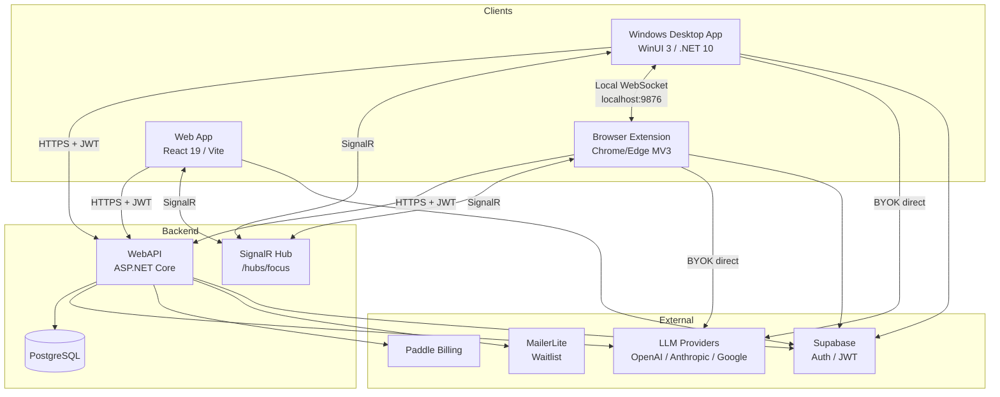

# Foqus Platform Overview

Foqus is a productivity platform that classifies your current focus context against a single active task and tracks alignment over time. Users define a task (e.g., "Review pull requests", "Research marketing strategy"), and Foqus evaluates every foreground window or browser tab to determine whether activity is aligned, neutral, or distracting.

---

## Platform Components

| Component | Stack | Purpose | Deployment |
|---|---|---|---|
| **Windows desktop app** | WinUI 3 / .NET 10 | Foreground window monitoring, focus scoring, floating overlay, local analytics | Microsoft Store (MSIX) |
| **Browser extension** | Chrome/Edge, Manifest V3, TypeScript/React/Vite | Page/tab classification, distraction overlay, session management | Chrome Web Store / Edge Add-ons |
| **WebAPI** | ASP.NET Core Minimal APIs, PostgreSQL | Auth, classification orchestration, sessions, subscriptions, analytics | Azure Container App (`api.foqus.me`) |
| **Web app** | React 19 / Vite / TypeScript | Cloud dashboard — sessions, analytics, billing, settings | Azure Static Web App (`app.foqus.me`) |
| **Website** | React 19 / Vite | Marketing landing page, legal pages | Azure Static Web App (`foqus.me`) |

---

## Solution Structure

| Project | Target | Builds on Linux | Purpose |
|---|---|---|---|
| `FocusBot.Core` | `net10.0` | Yes | Domain entities, interfaces, events. No external dependencies. |
| `FocusBot.Infrastructure` | `net10.0-windows` | No | Data access (EF Core/SQLite), Win32 services, Supabase auth, LLM providers, SignalR client |
| `FocusBot.App.ViewModels` | `net10.0` | Yes | Presentation logic (CommunityToolkit.Mvvm) |
| `FocusBot.App` | `net10.0-windows` | No | WinUI 3 UI, DI wiring, XAML, Win32 overlay |
| `FocusBot.WebAPI` | `net10.0` | Yes | Minimal API, vertical slice architecture, PostgreSQL |
| `browser-extension/` | TypeScript/React/Vite | Yes | Chrome Manifest V3 extension |
| `src/foqus-web-app/` | React 19/Vite | Yes | Cloud dashboard at `app.foqus.me` |
| `src/foqus-website/` | React 19/Vite | Yes | Marketing landing page at `foqus.me` |

No `.sln` file — build individual `.csproj` files. `TreatWarningsAsErrors` is on for all .NET projects.

### Test Projects

| Project | Tests | Builds on Linux |
|---|---|---|
| `FocusBot.Core.Tests` | ~25 tests | Yes |
| `FocusBot.WebAPI.Tests` | ~72 tests | Yes |
| `FocusBot.WebAPI.IntegrationTests` | ~28 tests | Yes |
| `FocusBot.App.ViewModels.Tests` | ~15 tests | No (Windows-only) |
| `FocusBot.Infrastructure.Tests` | ~6 tests | No (Windows-only) |
| `browser-extension/tests/` | ~76 tests (Vitest) | Yes |
| `src/foqus-web-app/` | ~12 tests (Vitest) | Yes |

---

## Architecture Diagram

---

## Authentication

All clients use **Supabase magic-link authentication** against the same Supabase project.

| Client | Sign-in flow | Callback |
|---|---|---|
| Desktop app | Deep link magic-link | `foqus://auth-callback` protocol activation |
| Browser extension | Options page magic-link | `chrome.runtime.getURL("src/options/index.html")` redirect |
| Web app | Login page magic-link | `/auth/callback` route |

The WebAPI validates Supabase-issued JWTs (ES256, JWKS) and auto-provisions a `User` row from the JWT `sub` claim on first `GET /auth/me` call.

---

## Classification Modes

| Mode | Key Source | Data Path | Gating |
|---|---|---|---|
| **BYOK** (Bring Your Own Key) | User-provided API key | Client → LLM provider directly | Free (no account needed for desktop/extension) |
| **Managed** (Foqus Account) | Platform-managed key | Client → WebAPI `POST /classify` → LLM | Requires active subscription or trial |

- **Desktop BYOK**: Supports OpenAI, Anthropic, Google via LlmTornado. Key encrypted with DPAPI.
- **Extension BYOK**: Supports OpenAI only. Key stored in `chrome.storage.local`.
- **Managed**: Both clients call `POST /classify` with JWT auth. WebAPI uses the platform key. Returns 402 when subscription/trial expired.

---

## Subscription Model

| Tier | `PlanType` enum | Key Source | Analytics | Sync |
|---|---|---|---|---|
| Trial (24h) | `TrialFullAccess` (0) | Platform-managed | Full (web app) | Yes |
| Foqus BYOK | `CloudBYOK` (1) | User-provided | Full (web app) | Yes |
| Foqus Premium | `CloudManaged` (2) | Platform-managed | Full (web app) | Yes |

**`SubscriptionStatus` enum**: `None`, `Trial`, `Active`, `Expired`, `Canceled` (serialized as camelCase strings in JSON).

- **Trial activation**: Auto-created when user first calls `GET /auth/me` (24-hour window).
- **Paid upgrade**: Paddle.js checkout on `app.foqus.me/billing`. Desktop and extension open the same web URL.
- **Webhook lifecycle**: Paddle → `POST /subscriptions/paddle-webhook` → DB update → SignalR `PlanChanged` → all clients refresh.
- **No free plan**: Users are on trial or paid. After trial expiry, managed classification returns 402.

---

## Integration Touchpoints

| Channel | Purpose | Details |
|---|---|---|
| **Local WebSocket** | Same-machine desktop ↔ extension task sync | `ws://localhost:9876/focusbot` — shared task, conflict resolution |
| **Extension Presence** | Dedup browser classification (desktop skips browser when extension is online) | `ws://localhost:9876/foqus-presence` — ping/pong |
| **SignalR Hub** | Cross-device real-time sync | `/hubs/focus` — session events, classification broadcast, plan changes |

See [docs/integration.md](integration.md) for protocol details and message formats.

---

## Domain Glossary

| Concept | Definition |
|---|---|
| **Task** | A user-defined focus objective (title + optional context). One active task at a time. |
| **Session** | A time-bounded focus period tied to a task. Contains aligned/distracted time, focus score, pause tracking. Server-managed lifecycle. |
| **Classification** | A single evaluation of whether current context (window/URL/page title) aligns with the active task. Returns score 1–10, mapped to Aligned (>5), Neutral (5), Distracted (<5). |
| **Focus Score** | Time-weighted alignment percentage (0–100) over a session. `focused / (focused + distracted) * 100`. |
| **Client** | A registered software installation (desktop app or extension instance). Has type, host, fingerprint, server-assigned ID. |
| **Heartbeat** | Periodic signal (60s) from client to backend for presence tracking. |
| **Device** | Synonym for Client in user-facing contexts. |

---

## Analytics

| Tier | Scope | Where |
|---|---|---|
| **Basic** (all users, local) | Session list, duration, aligned vs distracted time, focus score, simple counts, last 7 days | Desktop app, browser extension |
| **Full** (paid users, cloud) | Trends, multi-device view, charts, filters, comparisons, per-client breakdown, cloud history | Web app (`app.foqus.me/analytics`) |

Native clients do NOT duplicate full analytics UI — they link to `app.foqus.me/analytics`.

---

## Infrastructure

Managed via Terraform (`infra/terraform/`):

| Resource | Type | Purpose |
|---|---|---|
| Azure Container App | `api.foqus.me` | WebAPI hosting (0.25 CPU / 0.5Gi, 1-2 replicas) |
| Azure Container Registry | Basic SKU | Docker image storage |
| PostgreSQL Flexible Server | v16, B_Standard_B1ms | Database |
| Azure Static Web App (website) | `foqus.me` | Marketing landing page |
| Azure Static Web App (web app) | `app.foqus.me` | Cloud dashboard |
| Log Analytics Workspace | 30-day retention | Container App logs |
| Cloudflare DNS | CNAME + TXT | Domain routing (`foqus.me`, `api.foqus.me`, `app.foqus.me`) |

---

## CI/CD Pipeline

GitHub Actions workflow (`.github/workflows/ci.yml`) with 5 jobs:

1. **build-and-test** — .NET 10 SDK, restore, build WebAPI, run unit tests + integration tests
2. **terraform_infra** — Azure login, `terraform init` + `apply`. Outputs SWA API keys and ACR info
3. **deploy-frontend** — Deploy `foqus-website` to Azure SWA (`foqus.me`)
4. **deploy-web-app** — Build and deploy `foqus-web-app` to Azure SWA (`app.foqus.me`)
5. **deploy-backend** — Build Docker image, push to ACR, roll Container App via Terraform

Trigger: all pushes/PRs to `main`/`webapi` (build-and-test only for PRs; full pipeline on `main` push).

---

## Per-Project Documentation

| Document | Scope |
|---|---|
| [docs/desktop-app.md](desktop-app.md) | Windows desktop app — architecture, services, ViewModels, overlay, session lifecycle |
| [docs/webapi.md](webapi.md) | WebAPI — endpoints, database, slices, SignalR hub, Docker, configuration |
| [docs/browser-extension.md](browser-extension.md) | Browser extension — architecture, service worker, classification, auth, privacy |
| [docs/web-app.md](web-app.md) | Web app — routes, auth, billing, analytics dashboard |
| [docs/website.md](website.md) | Marketing website — routes, deployment |
| [docs/integration.md](integration.md) | Cross-cutting — WebSocket, SignalR, presence, shared auth, Paddle lifecycle |

## Reference Documentation

| Document | Scope |
|---|---|
| [docs/coding-guidelines.md](coding-guidelines.md) | C# and TypeScript/React coding standards |
| [docs/unit-testing.md](unit-testing.md) | C# (xUnit) and TypeScript (Vitest) testing standards |
| [docs/signalr-implementation.md](signalr-implementation.md) | SignalR hub architecture and client integration guide |
| [docs/paddle-guide.md](paddle-guide.md) | Paddle Billing reference (Foqus-specific + generic) |
| [docs/paddle-implementation-summary.md](paddle-implementation-summary.md) | Paddle integration implementation details |
| [docs/web-app-sign-in-and-trials.md](web-app-sign-in-and-trials.md) | Sign-in, provisioning, trial vs Paddle trialing |
| [docs/classification-coalescing.md](classification-coalescing.md) | Server-side classification dedup |
| [docs/extension-presence-protocol.md](extension-presence-protocol.md) | Local WebSocket presence protocol |
