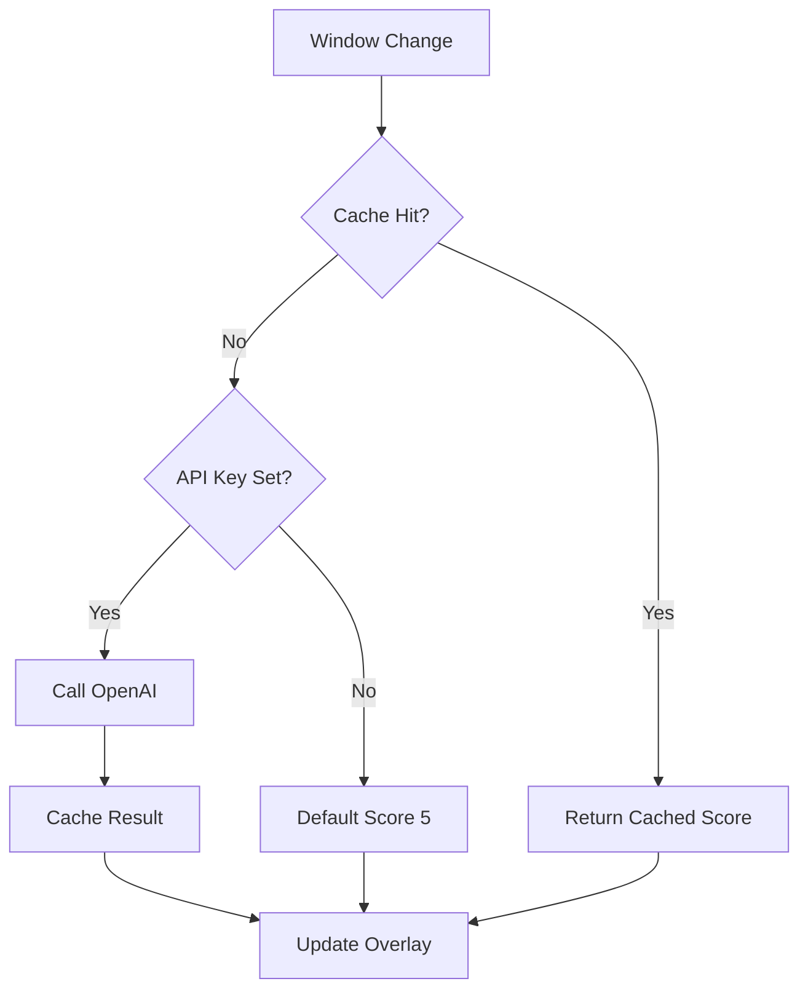

# Phase 3: OpenAI Setup + AI Alignment Classification

**User Feature**: See if your current window is aligned with your task, powered by OpenAI.

**End State**: User enters API key in settings, app classifies windows as Aligned/Neutral/Misaligned with visual indicator.

## What to Build

### Core Layer

- `AlignmentClassificationCacheEntry` entity: `ContextId`, `TaskDescription`, `Score` (1-10), `AlignmentStatus`, `Reason`, `CreatedAt`
- Add `RelevantWindowsHint` to `UserTask` (optional AI context)
- `IAlignmentClassificationCacheRepository`, `IOpenAIService`, `ISettingsService` interfaces

### Infrastructure Layer

- `SettingsService` with DPAPI encryption for API key storage
- `OpenAIService` using OpenAI SDK 2.* with gpt-4o-mini
- `AlignmentClassificationCacheRepository` for cache-first strategy
- Update `WindowChangeOrchestrator` to classify on window change

### App Layer

- Settings page with API key input (password field) and test connection button
- Focus indicator overlay (small floating window, always-on-top)
  - Green = Aligned (score 6-10)
  - Yellow = Neutral (score 4-5)
  - Red = Misaligned (score 1-3)
- Task edit dialog: add "Relevant windows hint" field
- Navigation to Settings from main shell

## Classification Flow



## OpenAI SDK 2.* Pattern

```csharp
var client = new OpenAIClient(apiKey);
var chatClient = client.GetChatClient("gpt-4o-mini");
var response = await chatClient.CompleteChatAsync(messages, options);
```

## Tests

- `OpenAIServiceTests.cs` - mocked API calls
- `AlignmentClassificationCacheRepositoryTests.cs` - cache operations
- Classification flow tests

## Checklist

- [ ] Define `AlignmentClassificationCacheEntry` entity
- [ ] Add `RelevantWindowsHint` property to `UserTask`
- [ ] Define `IAlignmentClassificationCacheRepository` interface
- [ ] Define `IOpenAIService` interface
- [ ] Define `ISettingsService` interface
- [ ] Implement `SettingsService` with DPAPI encryption
- [ ] Implement `OpenAIService` using OpenAI SDK 2.*
- [ ] Implement `AlignmentClassificationCacheRepository`
- [ ] Update `WindowChangeOrchestrator` to classify on window change
- [ ] Add NavigationView to app shell
- [ ] Create Settings page with API key input
- [ ] Add "Test Connection" button
- [ ] Create focus indicator overlay window
- [ ] Implement overlay color logic (green/yellow/red)
- [ ] Add "Relevant windows hint" to task edit dialog
- [ ] Write `OpenAIServiceTests.cs`
- [ ] Write cache repository tests
- [ ] Write classification flow tests
